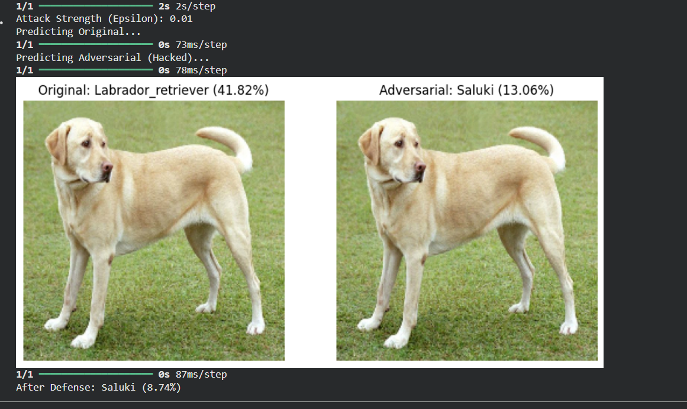

# Adversarial Robustness Testing for Edge AI (MobileNetV2)

## 📌 Project Overview
This project investigates the vulnerability of Edge AI models—specifically **MobileNetV2**, a standard architecture for mobile and IoT devices—to adversarial attacks.

Using the **Fast Gradient Sign Method (FGSM)**, I demonstrated how lightweight neural networks can be deceived by invisible perturbations, raising critical security concerns for autonomous systems and smart devices.

## 🛠️ Tech Stack
* **Language:** Python 3.x
* **Frameworks:** TensorFlow, Keras
* **Architecture:** MobileNetV2 (Pre-trained on ImageNet)
* **Attack Vector:** Fast Gradient Sign Method (FGSM)

## 📊 Results
I successfully generated adversarial examples with an attack strength (epsilon) of `0.01`. This resulted in a complete confidence collapse and misclassification without visible degradation to the human eye.

| Metric | Original Image | Adversarial Image |
| :--- | :--- | :--- |
| **Prediction** | Labrador Retriever | Saluki (Incorrect) |
| **Confidence** | 41.82% | 13.06% |
| **Visual Difference** | N/A | Imperceptible |

### Evidence

*(Figure 1: Comparison of Original vs. Adversarial input showing successful evasion attack)*

## 🛡️ Defense Mechanism
To mitigate this vulnerability, I explored **Input Sanitization** using JPEG compression as a preprocessing defense layer. This successfully disrupted the adversarial noise pattern and lowered the model's confidence in the incorrect prediction.

## 🚀 How to Run
1. Open the notebook in Google Colab or Jupyter.
2. Run the `MobileNet_FGSM_Attack.ipynb` notebook.
3. Observe the generation of adversarial noise and final classification.
